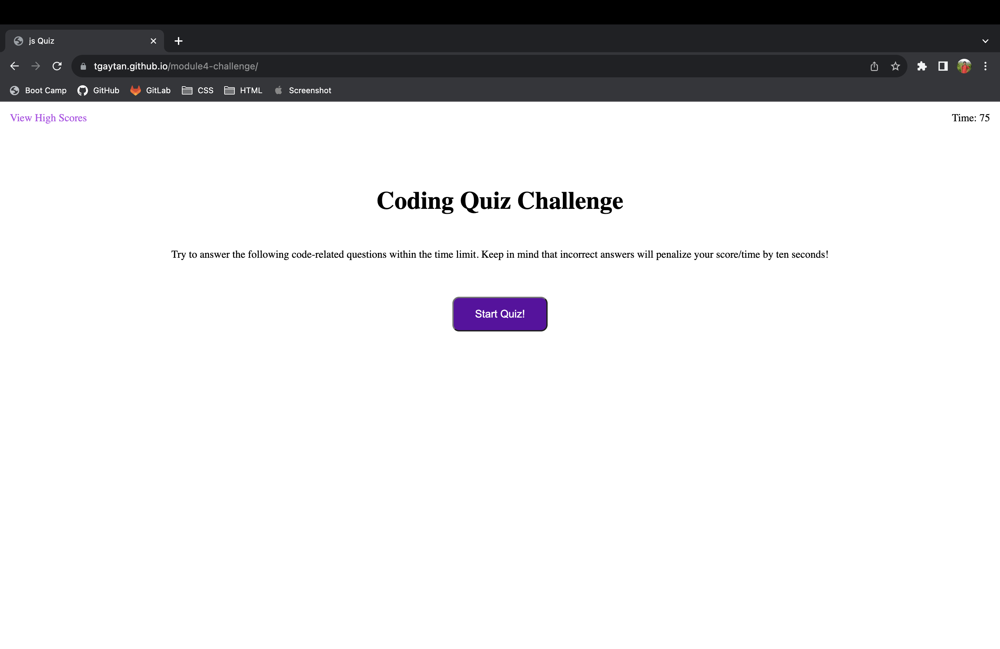

# Timed JavaScript Quiz

## Description

This webpage has a short quiz on JavaScript basics.  The quiz contains 5 questions and has a time limit of 75 seconds.  Incorrect answers will deduct 10 seconds from the timer.  Your score is the amount of time that is left.

JavaScript was used to update the elements based off the actions taken by the user.  I created this project in order to practice DOM manipulation with JavaScript.

## Installation

N/A

## Usage

Here is a screenshot of the webpage in GitHub pages.

To access the webpage, navigate to the following URL: https://tgaytan.github.io/module4-challenge/

To start the quiz, hit he "Start Quiz!" button.  This will present you with the first question in the quiz.  When you select a choice, the next question will be displayed.  Depending on your answer, either "Correct" or "Incorrect" will be displayed at the bottom.

The time remaining is shown in the top right-hand corner.

When all the questions are answered or the time has ran out, the results page will be shown.  On the results page you can record your score by inputting your initials and hitting the "Submit" button.

Thish will take you to the high scores page, where all the scores are shown.  To restart the quiz, hit the "Go Back" button.  If desired, you can clear all the scores using the "Clear High Scores" button.

At anytime during the quiz, you can access the high scores page by selecting the "View High Scores" link in the top left-hand corner.

## Credits

N/A

## License

N/A

## Tests

This is the answer key to the questions:

1.  alerts
2.  parenthesis
3.  all of the above
4.  quotes
5.  console.log

You can select the wrong answers to confirm time is deducted from the timer.  You can also let the timer run out of time and you will be taken to the results page.